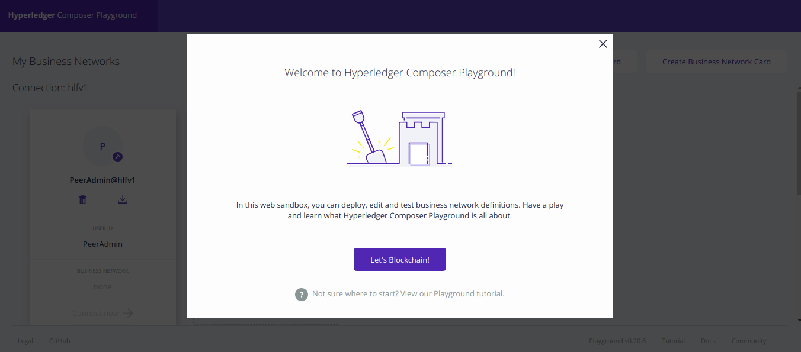
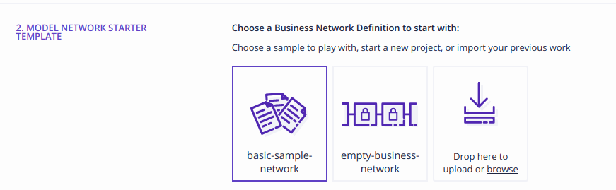
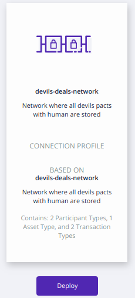

# Devil's Deals Network

Blockchain application which is used by the devil/deamons to for managing pacts with human. The application is based on [Hyperledger Composer](https://hyperledger.github.io/composer/latest/introduction/introduction) - tool for fast prototyping provate blockchain.

## Basic information

There are two types of participants:
* **Human** - mortals, who needs to make a deal, e.g. to gain some magical powers, immortality, love, welth, etc. 
* **Devil** (or deamon) - personification of evil, makes a deal with human and in return he could takes her/his soul forever.

There are three types of assets in ths blockchain:
* **Soul** - every *Human* should have it, *Devil* can collect it after fullfiling the *Deal*.
* **Proposal** - every *Human* can raise it so the *Devil* can review it and then decide whether to accept, and make a *Deal*, or reject it. *Human* can raise as many *Proposals* as she/he woul like.
* **Deal** - only *Devil* can raise it (using transaction) based on *Proposal* made by a *Human*. Each *Human* can have only one *Deal*, because in exchange of the *Deal* *Devil* will take her/his *Soul* and that *Human* can have only one.  

In this blockchain there are four types of transactions:
* **Give a Birht** - only *admin* can raise it and in this transaction *Human* participant is created with a *Soul* (*admin* can still add participant to the network, but she/he needs to remember to create also *Soul* in separate step).
* **Reject a Proposal** - *Devil* can do not accept the *Proposal* raised by a *Human*.
* **Make a Deal** - only *Devil* can make this transaction, based on *Proposal*. 
* **Take a Soul** - only *Devil* can raise it, once a person make a deal *Devil&* can take persons's *Soul* depending on the terms of an agreement (e.g. when person dies, do something special). The *Soul* is added to *Devil's* collection.


## How to install

If you want to install it on your local machine first you need to install Docker. The full instructions how to achieve can be found here:

* [Installing Docker on Ubuntu](https://docs.docker.com/install/linux/docker-ce/ubuntu/)
* [Installing Docker on Windows](https://docs.docker.com/docker-for-windows/install/)
* [Installing Docker on Mac](https://docs.docker.com/docker-for-mac/install/)

Next you need to open the console (terminal) and type:

```
docker run --name composer-playground --publish 8080:8080 --detach hyperledger/composer-playground
```

Above command will download and run the composer-playground Docker file. More about the playground could be found in [official documentation](https://hyperledger.github.io/composer/latest/playground/playground-index). 

After the above command has finished go to the web browser and type `localhost:8080`, so the web Playground will open.



If so, that's great! Now git clone this project using the command:

```
git clone https://github.com/wkrzywiec/devil-deals-network.git
```


After that you should have `devils-deals-network@0.0.1.bna` that can be deployed to the Hyperledger Fabric instance. To do so, go bakc to *Playground* in your web browser and then click *Deploy a new business network*.


There scroll down to the section where you can drop or browse the file to upload.



After choosing the file click *Deploy* button on the right side.



This blockchain was successfully deployed!


## How to play around with a blockchain 

In progress...

## Technical specification

### Tools versioning

* Docker version 18.09.6
* Composer-playground Docker image tag - 0.20.8

